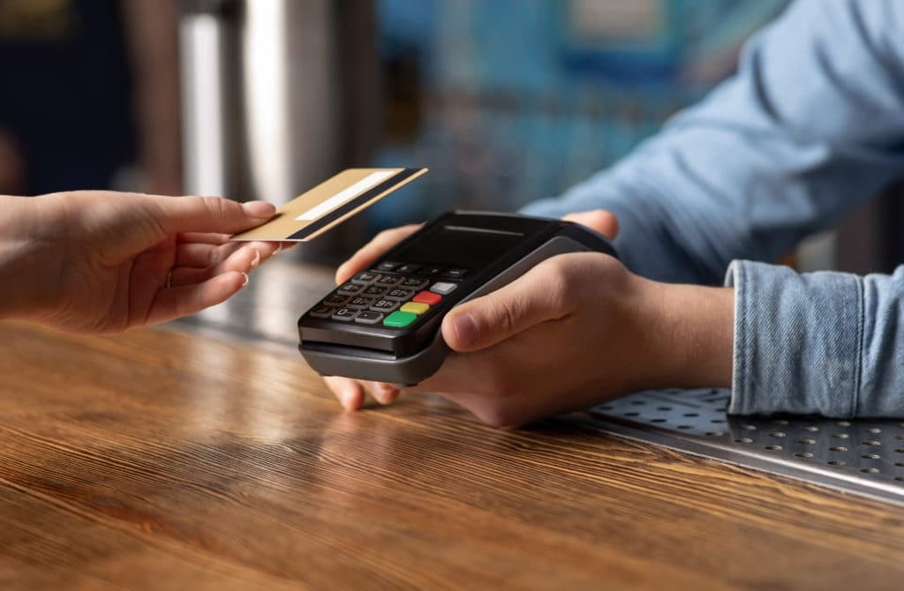

# Near Field Communication (NFC)

**NFC (Near Field Communication)** ist eine Funktechnik für **sehr kurze Distanzen** (meist **unter 4 cm**). Zwei Geräte tauschen dabei Daten aus, **ohne Kabel**, schnell und einfach – oft reicht es, sie **kurz aneinanderzuhalten**.

## Typische Anwendungsgebiete

* **💳 Kontaktloses Bezahlen**
  Mit dem Smartphone, der Smartwatch oder der Bankkarte (z. B. an der Supermarktkasse).
* **🚪 Zugang & Tickets**
  Türschlösser, Hotelkarten, Vereinsräume, ÖPNV-Tickets, Events.
* **📱 Schnelles Koppeln**
  Bluetooth-Geräte wie Kopfhörer oder Lautsprecher per Antippen verbinden.
* **🏷️ NFC-Tags**
  Kleine Aufkleber/Chips, die Aktionen auslösen:
  WLAN verbinden, Webseite öffnen, Smart-Home-Szenen starten.
* **🪪 Ausweise & Karten**
  Elektronische Ausweise, Mitarbeiterausweise, Mitgliedskarten.

---

## Merkmale auf einen Blick

* 🔒 **Sicher**, weil sehr kurze Reichweite
* ⚡ **Schnell & bequem**, kein Suchen im Menü
* 🔋 **Energiesparend**

👉 **Merksatz:** *NFC ist wie ein digitaler Handschlag – kurz, nah und praktisch.*

Mehr dazu: [Near Field Communication](https://de.wikipedia.org/wiki/Near_Field_Communication)

